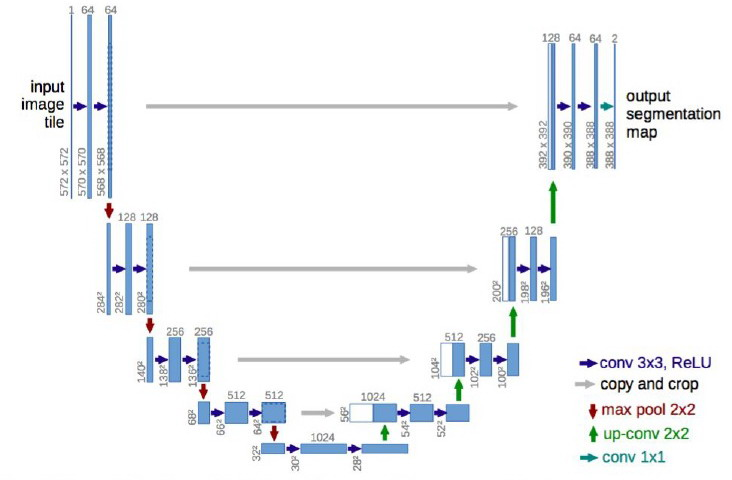

# BrainScan

This project is the result of the final assignment from the UPC Postgraduate course in _Artificial Intelligence with Deep Learning_.
It consists on implementing the U-net model for medical image segmentation, precisely for brain tumor segmentation.




## Getting Started

These instructions will get you a copy of the project up and running on your local machine for development and testing purposes. For our model to work all of the dependencies are on the requirements.txt.
Run the following command line on your local repository.
```
pip install -r requirements.txt
```

### Structure of the repository
As we have already mentioned, the main goal was to implement the U-Net so as to perform image segmentation so as to identify the tumour. The part regarding the U-Net architecture can be found in the folder _models_ (inside _src_). On the other hand, _preprocessing_ (also in _src_) stores the scripts that deal with the already mentioned task of slicing and storing all the data. Finally, the scripts that actually perform the segmentation can also be found in the _src_ folder. In fact, such folder contains a README file which explains in detail its content.\
The other folder that can be seen from here is the _data_ one, which mainly stores images used along the repository and used to illustrate some of the results.


### The dataset
The BRATS challenge dataset was used to train and test this model. Find the data on the following link:
http://medicaldecathlon.com/

This dataset consists on a training set composed of 484 patients and a testing one with 266 patients, although we kept a certain amount of the former so as to perform validation. See more about validation on the _preprocessing_ folder (inside _src_).\
Each patient involves four different 3D images (each one highlighting different areas of the tumour) plus another 3D image, which is the ground truth. Since we were not very confident dealing with 3D images, we decided to slice each of them axially into 155 slices.

Let us now explain the input of the U-Net and the labels. First of all, let us fix a patient. Then, we are going to take the first slice of each of the four images regarding that patient and we are going to concatenate them. Afterwards, we are going to take the second slice of each image regarding that patient and we are going to concatenate them. And we keep doing so until we obtain 155 blocks of 4 slices. For the sake of clarity, let us say that the k-th block will be the concatenation of the k-th slice of each image. At this point, we concatenate all the blocks. Therefore, a single patient is represented by this last block.\
On the other hand, the label of a patient is an image whose pixels can take values 0, 1, 2 or 3, where _0_ stands for the background and the other three ones stand for different parts of the tumour tissue.\
In the different experiments that we have carried out, different ways of expressing the labels have been used. In some of them, we have regarded the labels as having one channel and taking values in the set {0, 1, 2, 3}, but, in some others, we expressed them using one-hot encoding, which implies that the labels had four channels. The main point of using the second approach is the fact that, when implementing the IoU metrics, the tensors should be represented using one-hot encoding. Another approach that we took was, instead of distinguishing between background and three different tumour tissues, we distinguished between background and tumour. That is, we performed a binary classification (at pixel level). It is worth noting that, when performing the binarization of the label, it can have two or one channels, depending on whether we are doing a one hot encoding or not respectively.


### Implementation


### References
* https://github.com/zhixuhao/unet/blob/master/model.py
* http://ronny.rest/blog/post_2017_09_11_tf_metrics/
* https://arxiv.org/pdf/1505.04597.pdf
* https://medium.com/ymedialabs-innovation/how-to-use-dataset-and-iterators-in-tensorflow-with-code-samples-3bb98b6b74ab
